# 赛博城市 `SMIL 动效` `2D`



```
用 SVG 画"赛博城市"夜景：
- 深蓝夜空 + 底部薄雾渐变，楼群剪影高低错落（部分楼体霓虹描边：青/品红）
- 窗户灯 30+ 个错位闪烁（opacity 循环 begin 错开）
- 两台飞行器拖光尾横掠天空（animateMotion 循环）
- 顶部霓虹招牌文字"NEO CITY"闪烁
- 画布 1200×800 深底
```
