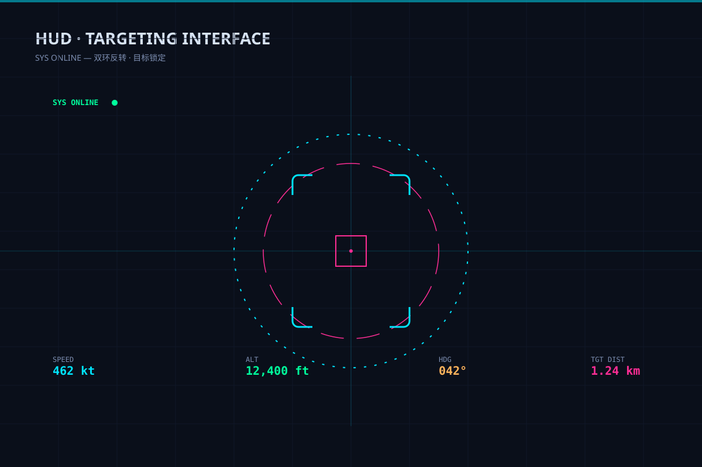

# HUD 瞬准界面 `SMIL 动效` `2D`



```
用 SVG 做"HUD 平显界面"：
- 深底 + 全屏淡网格，中央双层刻度环反向旋转（外环顺时针、内环逆时针）
- 目标锁定框：四角括号框呼吸缩放，中心十字准星
- 横竖基准线贯穿，四角数据读数（速度/高度/航向/目标距离）
- 顶部状态条 SYS ONLINE 闪烁，一条水平扫描线循环上下
- 画布 1200×800 深底 #0a0f1a，电光青 #00e5ff 主色
```
