# 傅里叶级数 · 谐波构建 `SMIL 动效` `2D`

分类：[科学与原理](../_about.md)



```
用 SVG 制作“傅里叶级数 · 谐波构建”：Sₙ(x) = 4/π Σ sin((2k−1)x)/(2k−1) / 周期 2π。
- 画布1400×900，深色底、34px标题、17–18px说明、14px刻度；蓝色主模型、绿色对照、橙色重点。
- 主结论：增加奇次谐波使过渡区变窄；跃点附近的吉布斯超调不会消失。
- 方波周期2π，(−π,0)为−1、(0,π)为+1，跃点取0；N1/3/9/25项，每项频率2k−1。
- 绘图区x−π..π、y−1.6..1.6，601点，静态与动画使用同一公式与尺度；动画每2秒切换项数，离散切换不伪装成连续物理时间。
- 吉布斯超调极限约跳变量8.95%，发生范围随项数变窄；不可写成增加项数就完全无超调。
- 理想化教学模型；明确参数、坐标范围与近似条件，不伪装成实验观测。
- 动画使用SMIL预计算取样，不引入脚本；同一构造中的全部动画共同起点、时长和参数序列。减少动效模式隐藏motion组，显示完整fallback静态快照；动效不改变数值编码。
```
