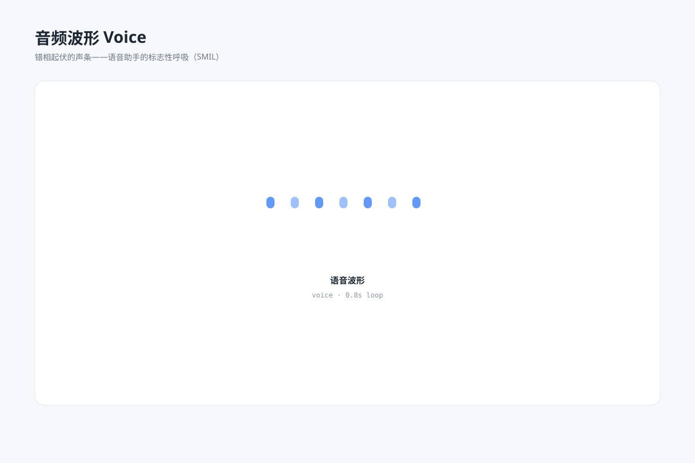

# 音频波形 `SMIL 动效` `2D`

分类：[界面与组件](../_about.md)



```
用 SVG 做一张"音频波形规格图"：
- 7 根圆角竖条一排，全部绕同一水平中心线上下伸缩起伏（height 与 y 成对补间，保持中心不变）
- 每根条 begin 用负值错开相位，形成波浪般的此起彼伏
- 蓝色系、透明度略有交替，下方标注 语音波形 voice · 0.8s 循环
- 画布 1200×800，浅蓝灰背景 #f6f8fb，白色圆角卡片，主色 #4f8ef7
```
