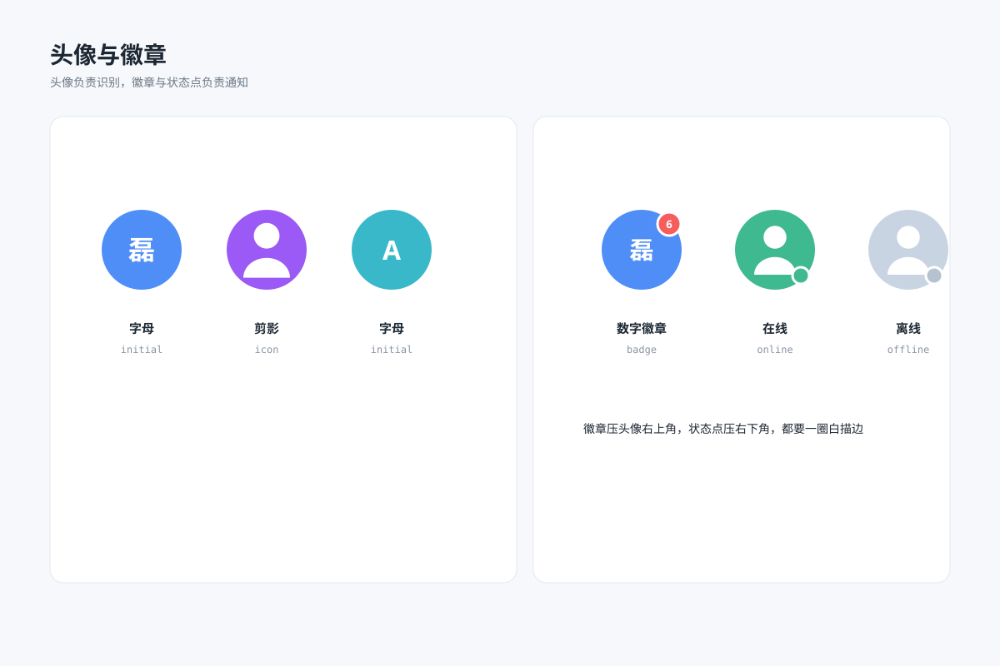

# 头像与徽章 `静态` `2D`



```
用 SVG 画一张"头像与徽章规格图"：
- 左卡三种圆形头像（半径相同）：蓝底白字"磊"、紫底白色人形剪影、青底白字"A"，下方标名称
- 右卡：一个头像右上角叠红色数字徽章"6"（白描边），另一个头像右下角绿色在线状态点、灰色离线状态点（白描边）
- 徽章与状态点都压在头像边缘上
- 画布 1200×800，浅蓝灰背景 #f6f8fb，白色圆角卡片，徽章红 #f65e5e、在线绿 #3fb98f
```
