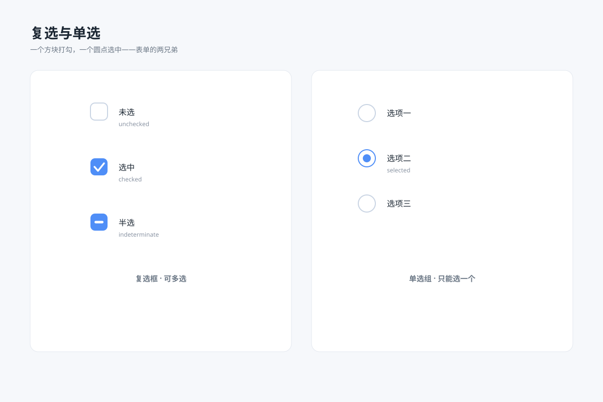

# 复选与单选 `静态` `2D`



```
用 SVG 画一张"复选与单选规格图"：
- 左卡复选框三态：未选（白底灰框）、选中（蓝底白勾）、半选（蓝底白色横杠），右侧标状态名
- 右卡单选组：三个选项纵向排列，第二个选中（蓝色圆环 + 实心内点），其余未选
- 选中勾和横杠用白色圆头描边
- 画布 1200×800，浅蓝灰背景 #f6f8fb，白色圆角卡片，主色 #4f8ef7
```
