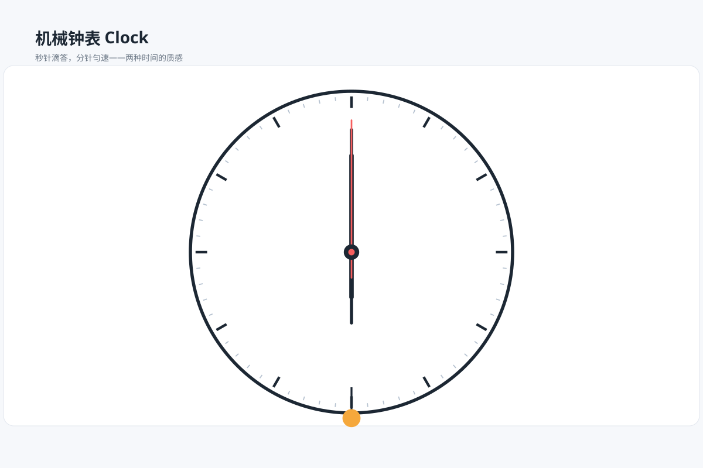

# 钟表 `SMIL 动效` `2D`

分类：[界面与组件](../_about.md)



```
用 SVG 做"机械钟表动画"：
- 大表盘：60 个刻度（12 个主刻度加粗）、罗马数字可省、中心轴帽
- 秒针细长红色，30° 一步滴答跳动（calcMode discrete，6 秒一圈）
- 分针粗短深色匀速旋转（6 秒一圈演示速度）、时针最短慢速
- 表盘下方摆锤式小刻度装饰左右摆动
- 画布 1200×800 浅蓝灰背景，白色圆角图表卡
```
