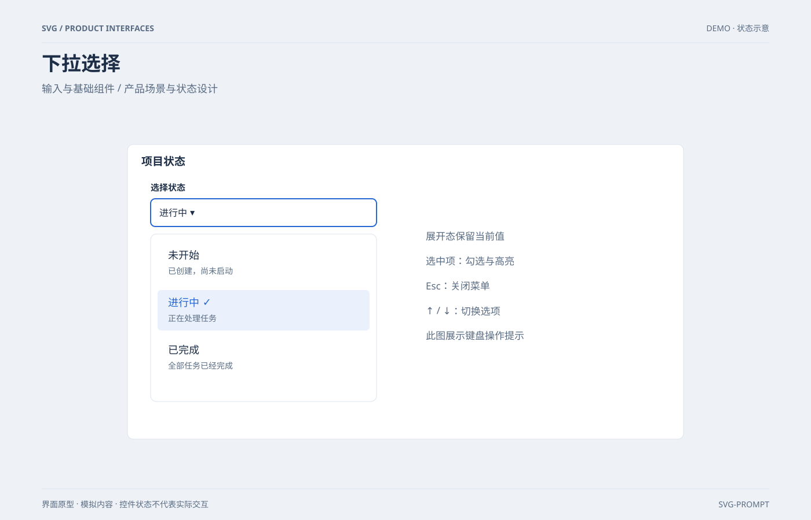

# 下拉选择 `静态` `2D`

分类：[界面与组件](../_about.md)



```
用 SVG 制作“下拉选择”，用于输入与基础组件。
- 画布1400×900；浅色产品界面，背景#eef2f7、卡片#ffffff、正文#1d2e46、辅助文字#596b82、主色#2467d5；34px标题、15–19px正文、圆角8–12px、8px间距基准。
- 顶部作品标题与分组说明，内容位于x80..1320、y210..820；底部标注界面原型、模拟内容和非真实交互。
- 触发框与菜单对齐，当前进行中有勾选；普通项和选中项不混淆。
- 文字与示例值包含：["SVG / PRODUCT INTERFACES", "DEMO · 状态示意", "下拉选择", "输入与基础组件 / 产品场景与状态设计", "界面原型 · 模拟内容 · 控件状态不代表实际交互", "SVG-PROMPT", "项目状态", "选择状态", "进行中  ▾", "未开始", "已创建，尚未启动", "进行中  ✓", "正在处理任务", "已完成", "全部任务已经完成", "展开态保留当前值", "选中项：勾选与高亮", "Esc：关闭菜单", "↑ / ↓：切换选项", "此图展示键盘操作提示"]。
- 控件由SVG图形展示状态，不添加真实网络、登录、支付或权限操作；模拟场景不能宣称实时服务。
```
