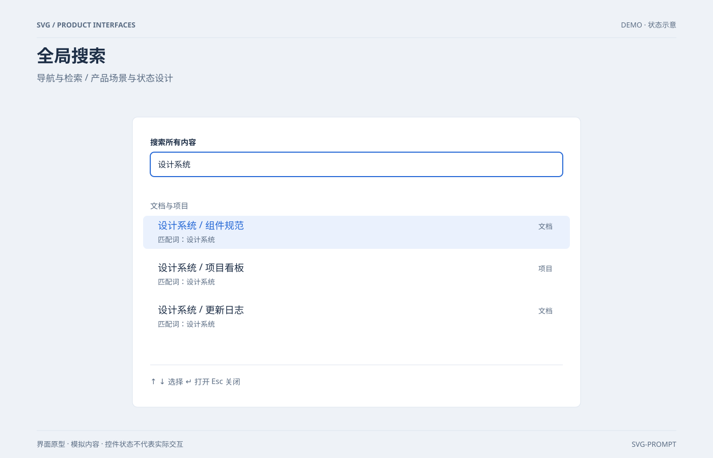

# 全局搜索 `静态` `2D`

分类：[界面与组件](../_about.md)



```
用 SVG 制作“全局搜索”，用于导航与检索。
- 画布1400×900；浅色产品界面，背景#eef2f7、卡片#ffffff、正文#1d2e46、辅助文字#596b82、主色#2467d5；34px标题、15–19px正文、圆角8–12px、8px间距基准。
- 顶部作品标题与分组说明，内容位于x80..1320、y210..820；底部标注界面原型、模拟内容和非真实交互。
- 输入区域、分组结果、键盘选中态与键盘提示清楚；搜索按文档/项目分类，明确匹配关键词。
- 文字与示例值包含：["SVG / PRODUCT INTERFACES", "DEMO · 状态示意", "全局搜索", "导航与检索 / 产品场景与状态设计", "界面原型 · 模拟内容 · 控件状态不代表实际交互", "SVG-PROMPT", "搜索所有内容", "设计系统", "文档与项目", "设计系统 / 组件规范", "文档", "匹配词：设计系统", "设计系统 / 项目看板", "项目", "设计系统 / 更新日志", "↑ ↓ 选择    ↵ 打开    Esc 关闭"]。
- 控件由SVG图形展示状态，不添加真实网络、登录、支付或权限操作；模拟场景不能宣称实时服务。
```
