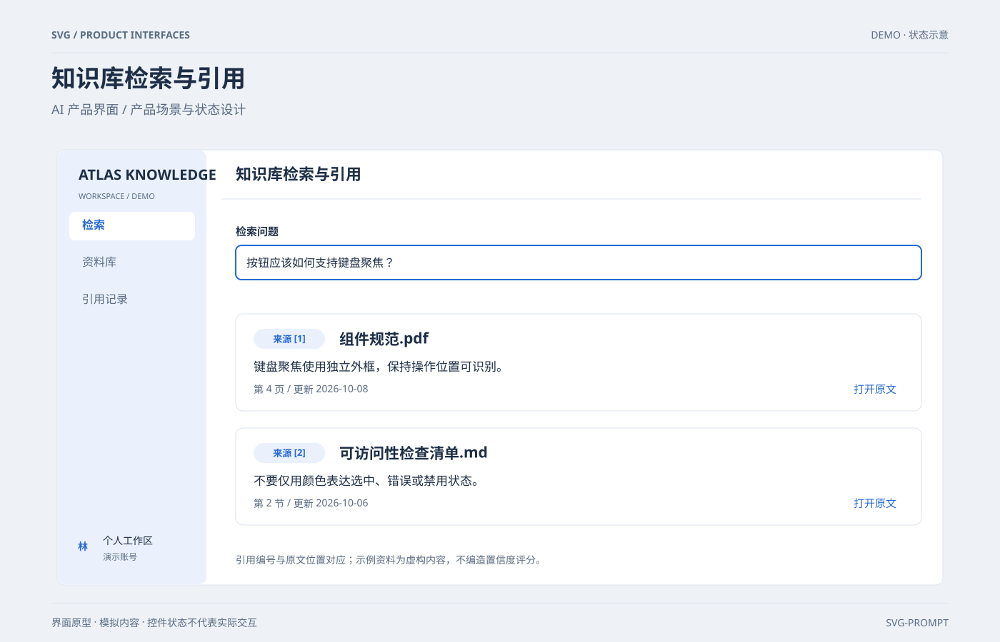

# 知识库检索与引用 `静态` `2D`

分类：[界面与组件](../_about.md)



```
用 SVG 制作“知识库检索与引用”，用于AI 产品界面。
- 画布1400×900；浅色产品界面，背景#eef2f7、卡片#ffffff、正文#1d2e46、辅助文字#596b82、主色#2467d5；34px标题、15–19px正文、圆角8–12px、8px间距基准。
- 顶部作品标题与分组说明，内容位于x80..1320、y210..820；底部标注界面原型、模拟内容和非真实交互。
- 检索问题与两条出处对应，包含文件名/页码或章节/更新时间；引用明确可追溯，不展示无依据的相关性百分比。
- 文字与示例值包含：["SVG / PRODUCT INTERFACES", "DEMO · 状态示意", "知识库检索与引用", "AI 产品界面 / 产品场景与状态设计", "界面原型 · 模拟内容 · 控件状态不代表实际交互", "SVG-PROMPT", "ATLAS KNOWLEDGE", "WORKSPACE / DEMO", "检索", "资料库", "引用记录", "林", "个人工作区", "演示账号", "检索问题", "按钮应该如何支持键盘聚焦？", "来源 [1]", "组件规范.pdf", "键盘聚焦使用独立外框，保持操作位置可识别。", "第 4 页 / 更新 2026-10-08", "打开原文", "来源 [2]", "可访问性检查清单.md", "不要仅用颜色表达选中、错误或禁用状态。", "第 2 节 / 更新 2026-10-06", "引用编号与原文位置对应；示例资料为虚构内容，不编造置信度评分。"]。
- 控件由SVG图形展示状态，不添加真实网络、登录、支付或权限操作；模拟场景不能宣称实时服务。
```
