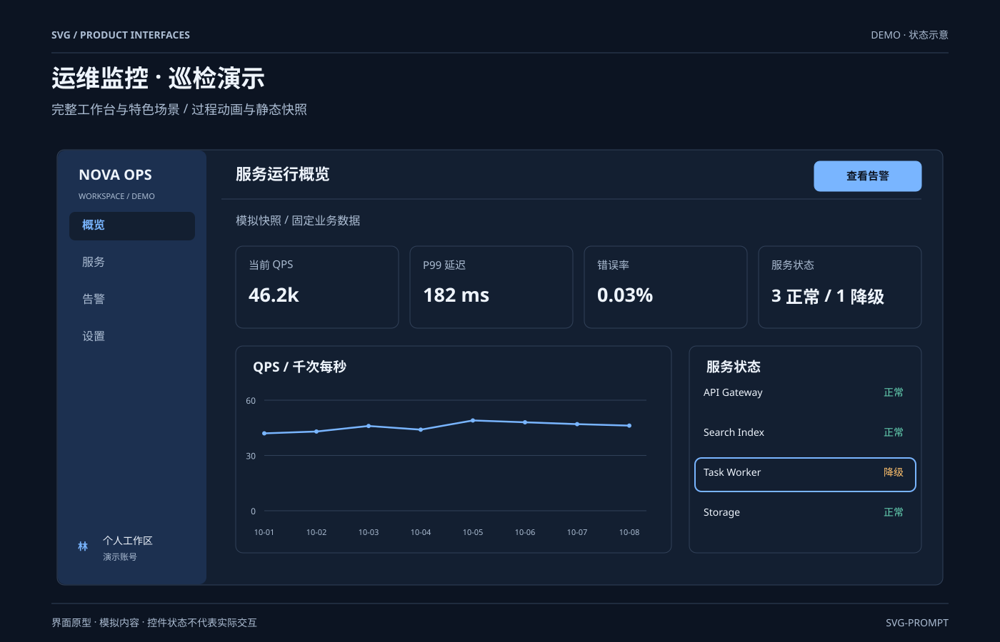

# 动态大屏 `SMIL 动效` `2D`

分类：[界面与组件](../_about.md)



```
用 SVG 做"深色动态监控大屏"（全部动效循环）：
- 深底 #0d1420，顶部 NOVA OPS 标题栏 + DEMO 红点，全部为模拟数据
- 左上固定QPS示例46.2k；上方右侧折线做形变动画
- 右侧服务状态灯呼吸列表（6行）；左下雷达持续旋转，中间集群负载条动画
- 底部固定告警示例条，不承诺跑马灯
- 画布 1200×800 深底，霓虹青紫配色
```
