# 模拟监控数据流 `SMIL 动效` `2D`

分类：[界面与组件](../_about.md)



```
用 SVG 做"模拟监控信号滚动折线"：
- 一条心电监护风格的青色折线在裁剪窗口内持续向左滚动，右缘用渐变淡出
- 顶部"SIM 模拟监控"标签 + 闪红圆点
- 此图仅为监控界面视觉演示，无数据接口，循环信号不代表真实实时数据或医疗测量；不得把装饰信号当作科学结论
- 动画无限循环
- 画布 1200×800 浅蓝灰背景，白色圆角图表卡
```
