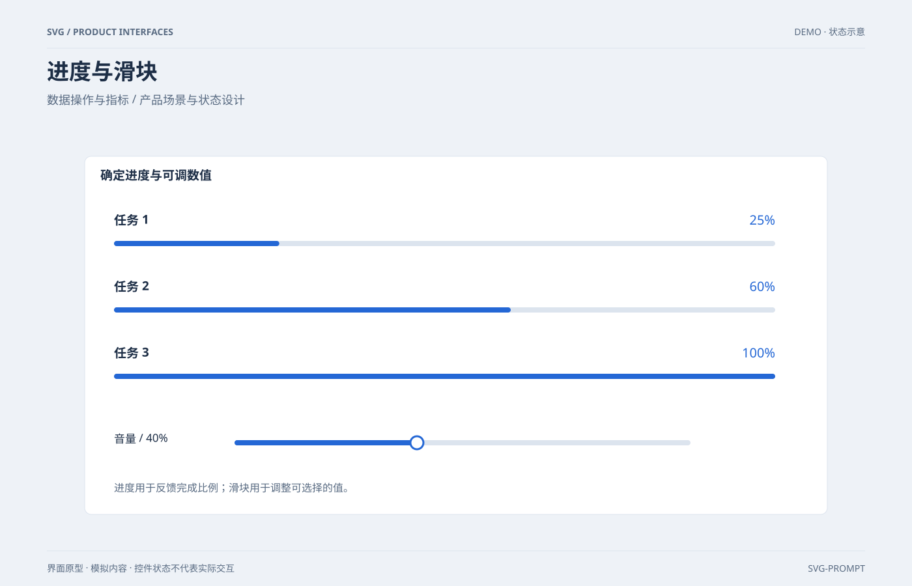

# 进度条与滑块 `静态` `2D`



```
用 SVG 画一张"进度与滑块规格图"：
- 上卡三根进度条：25% / 60% / 90% 三档，圆角浅灰轨道 + 蓝色圆角填充，右端标注百分比
- 下卡一个滑块：轨道左段蓝色已填充、右段灰色，圆形白底蓝边手柄停在 40% 处
- 画布 1200×800，浅蓝灰背景 #f6f8fb，白色圆角卡片，主色 #4f8ef7、轨道 #e3e8ef
```
