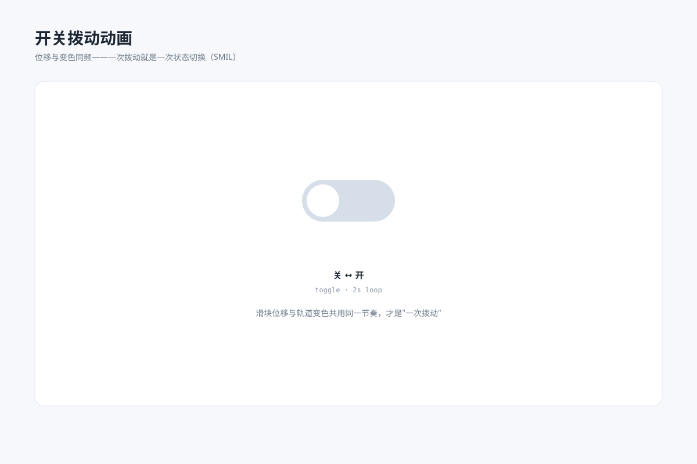

# 开关拨动动画 `SMIL 动效` `2D`



```
用 SVG 做一张"开关动效规格图"：
- 一个大号开关：白色滑块在轨道左右两端之间自动往返拨动（cx 循环补间），轨道颜色同步在灰与蓝之间渐变（fill 循环补间）
- 位移与变色用相同的 dur 与节奏，视觉上是"一次完整的拨动"
- 下方标注 关 ↔ 开 · 2s 循环
- 画布 1200×800，浅蓝灰背景 #f6f8fb，白色圆角卡片，主色 #4f8ef7、关态轨道 #d5dee9
```
